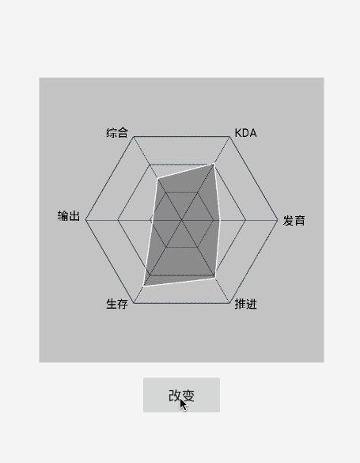

# RadarView

a radar view 



# How do I use it?


```xml

 <mio.kon.radarview.RadarView
        android:layout_centerInParent="true"
        xmlns:mio="http://schemas.android.com/apk/res-auto"
        android:id="@+id/radarView"
        mio:radius="100dp"
        mio:abilityColor="#50000000"
        mio:abilityLineColor="#ffffff"
        mio:textSize="12sp"
        android:layout_width="wrap_content"
        android:layout_height="wrap_content"/>
```

**you can use attribute diy radar view:**

`lineColor`,`textColor`,`abilityColor`,`abilityLineColor`,`textSize` and `radius`

**simple**

```java
RadarView radarView = findViewByid (R.id.radarView);
        RadarMap radarMap = new RadarMap ();
        radarMap.put ("综合",67.2f);
        radarMap.put ("KDA",68.2f);
        radarMap.put ("发育",70f);
        radarMap.put ("推进", 82f);
        radarMap.put ("生存", 50.5f);
        radarMap.put ("输出", 70f);
        radarView.setAbility (radarMap);
```

**if you want change the value,you just use map's `put` mathod. such as:**

```java
		i = 5;
        findViewByid (R.id.change).setOnClickListener (v->{
            radarMap.put ("综合",67.2f-i);
            radarMap.put ("KDA",68.2f-i);
            radarMap.put ("发育",70f-i);
            radarMap.put ("推进", 82f-i);
            radarMap.put ("生存", 50.5f-i);
            radarMap.put ("输出", 70f-i);
            i+=5;
        });
```
	

# Developed By

Mio4kon - <mio4kon.dev@gmail.com>

# License

 	Copyright 2015 mio4kon

    Licensed under the Apache License, Version 2.0 (the "License");
    you may not use this file except in compliance with the License.
    You may obtain a copy of the License at

       http://www.apache.org/licenses/LICENSE-2.0

    Unless required by applicable law or agreed to in writing, software
    distributed under the License is distributed on an "AS IS" BASIS,
    WITHOUT WARRANTIES OR CONDITIONS OF ANY KIND, either express or implied.
    See the License for the specific language governing permissions and
    limitations under the License.

